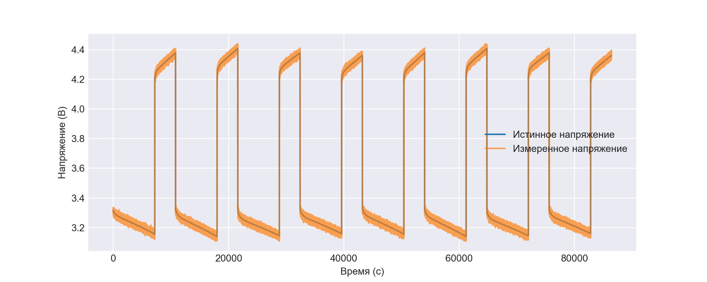
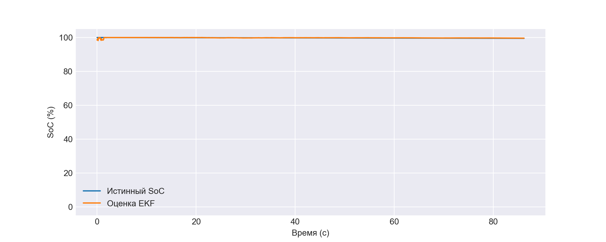
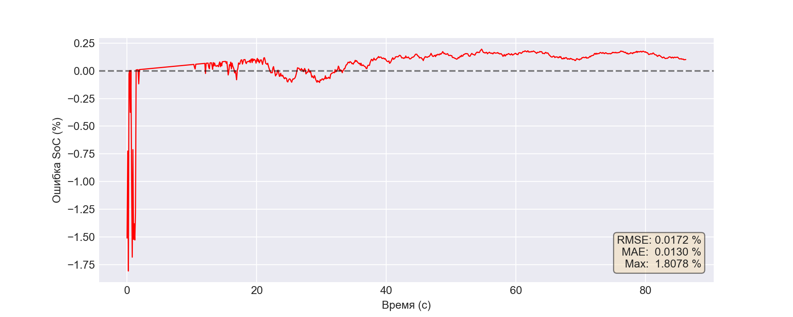
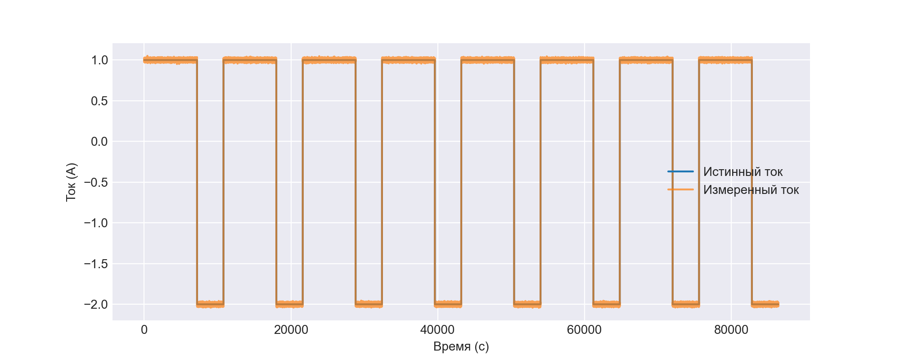
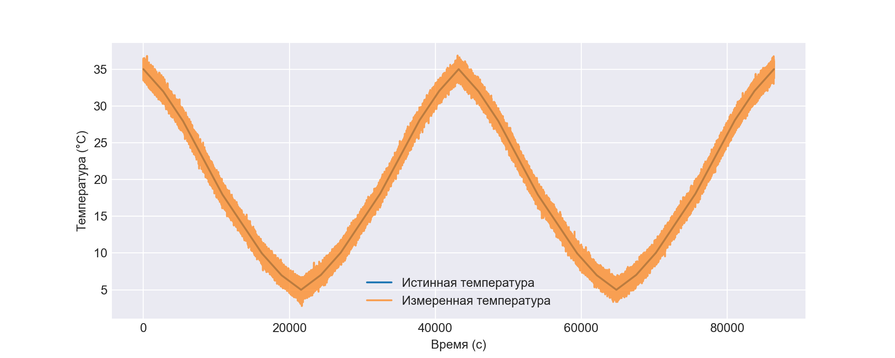

# Отчёт по симуляции: record
**Исходный файл:** `record.csv`

## Метрики оценки SoC
| Метрика | Значение (отн. ед.) | Значение (%) |
|---------|---------------------|--------------|
| RMSE | 0.000172 | 0.0172 % |
| MAE  | 0.000130 | 0.0130 % |
| Max Error | 0.018078 | 1.8078 % |

## Измерение напряжения
RMSE (истинное vs измеренное): 0.009993 В

## Информация об эксперименте
Всего кадров: 863998
Длительность: 86399.8 с

## Графики
### Напряжение

### Степень заряда (первые 0% данных)

### Ошибка SoC (первые 0% данных)

### Ток

### Температура
