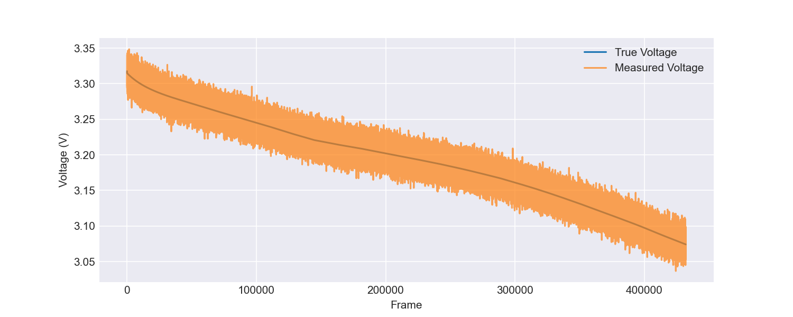
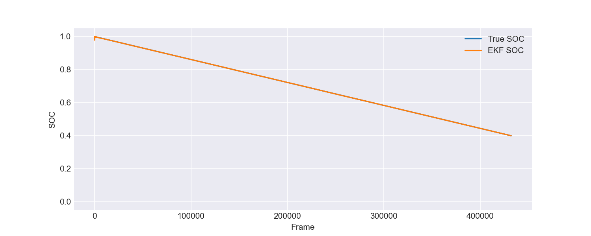
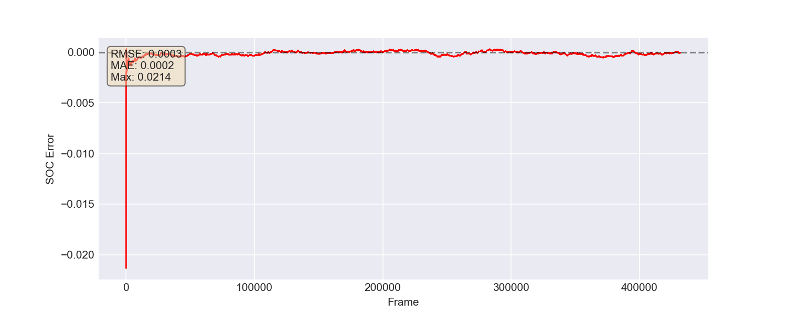
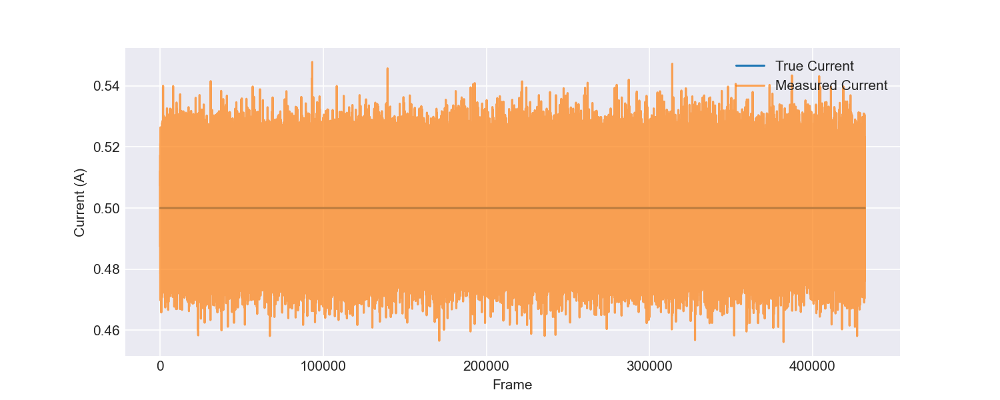
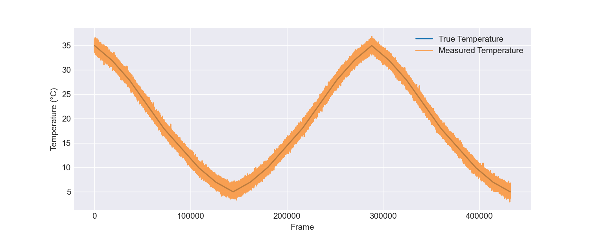

# Simulation Report: record
**Source file:** `record.csv`

## SOC Estimation Metrics
| Metric | Value |
|--------|-------|
| RMSE | 0.000261 |
| MAE | 0.000195 |
| Max Error | 0.021362 |

## Voltage Measurement
RMSE (True vs Measured): 0.010000 V

## Experiment Info
Total frames: 431998

## Plots
### Voltage

### State of Charge

### SOC Error

### Current

### Temperature
