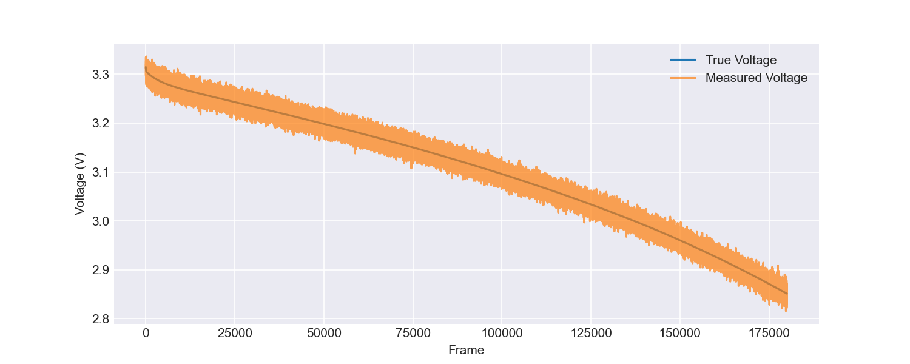
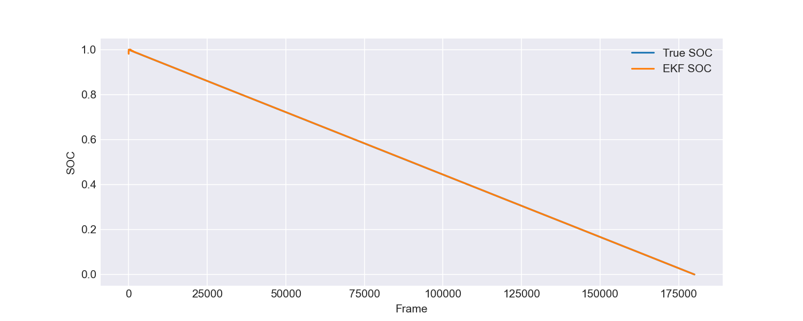
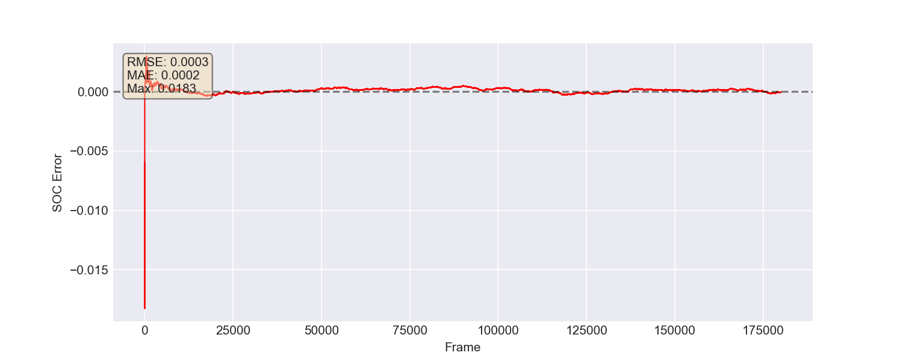
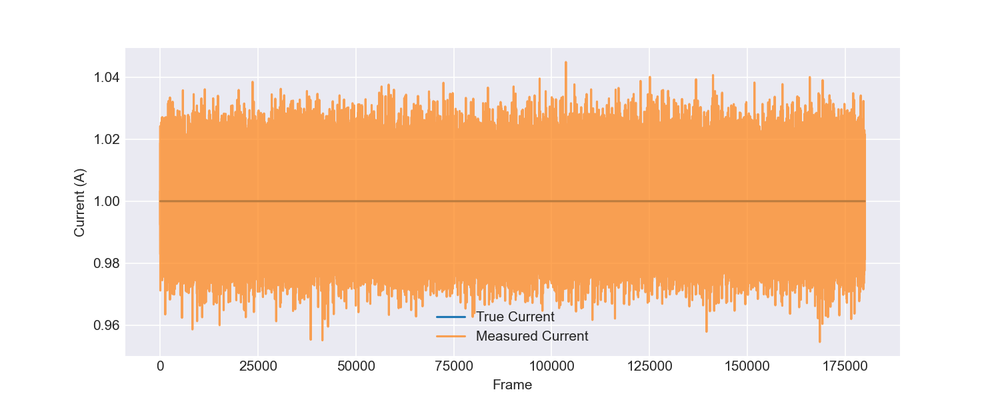
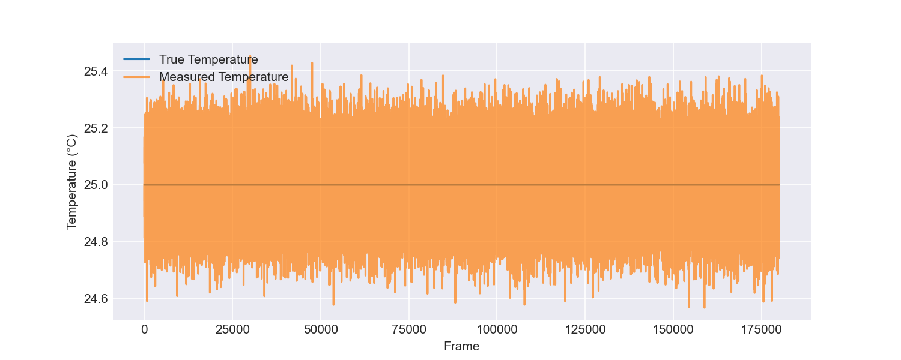

# Simulation Report: record
**Source file:** `record.csv`

## SOC Estimation Metrics
| Metric | Value |
|--------|-------|
| RMSE | 0.000257 |
| MAE | 0.000178 |
| Max Error | 0.018279 |

## Voltage Measurement
RMSE (True vs Measured): 0.009995 V

## Experiment Info
Total frames: 179998

## Plots
### Voltage

### State of Charge

### SOC Error

### Current

### Temperature
