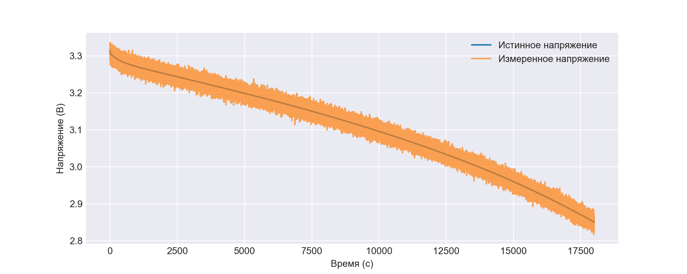
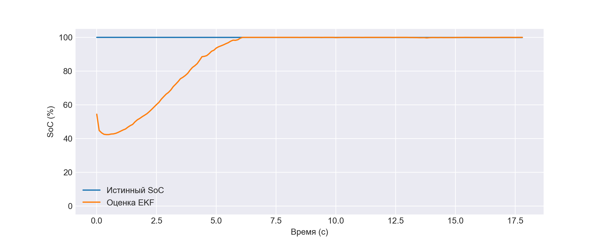
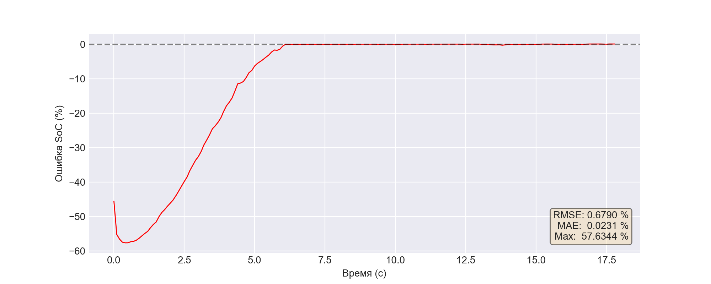
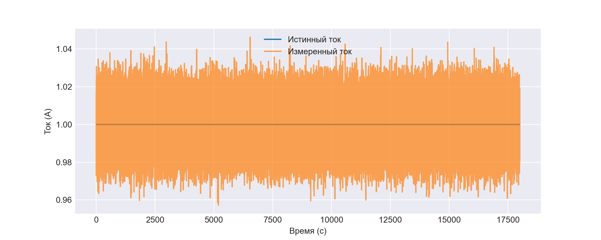
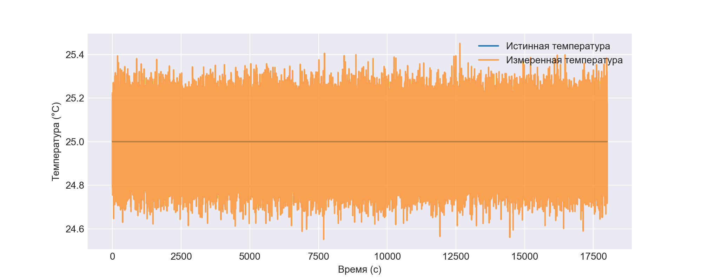

# Отчёт по симуляции: record
**Исходный файл:** `record.csv`

## Метрики оценки SoC
| Метрика | Значение (отн. ед.) | Значение (%) |
|---------|---------------------|--------------|
| RMSE | 0.006790 | 0.6790 % |
| MAE  | 0.000231 | 0.0231 % |
| Max Error | 0.576344 | 57.6344 % |

## Измерение напряжения
RMSE (истинное vs измеренное): 0.010001 В

## Информация об эксперименте
Всего кадров: 179998
Длительность: 17999.8 с

## Графики
### Напряжение

### Степень заряда (первые 0% данных)

### Ошибка SoC (первые 0% данных)

### Ток

### Температура
