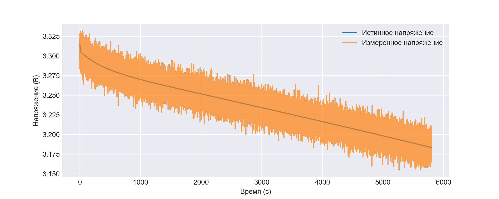
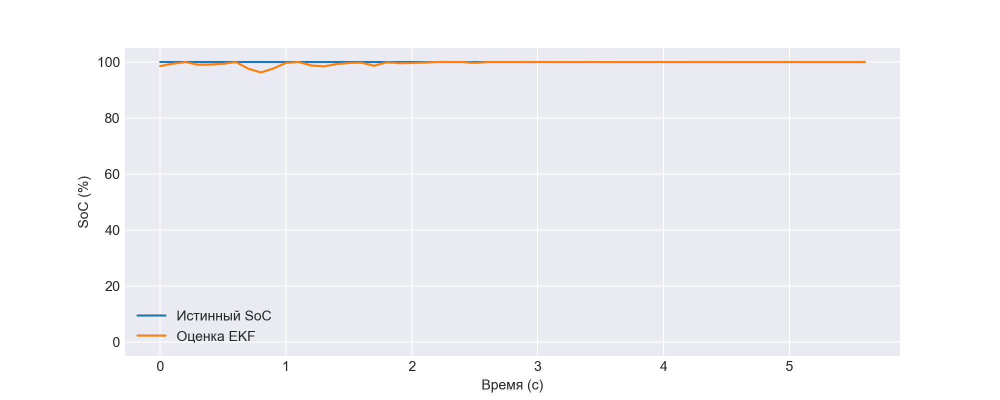
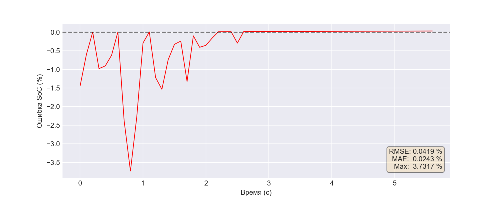
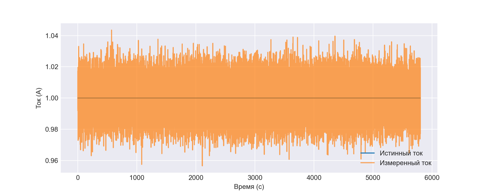
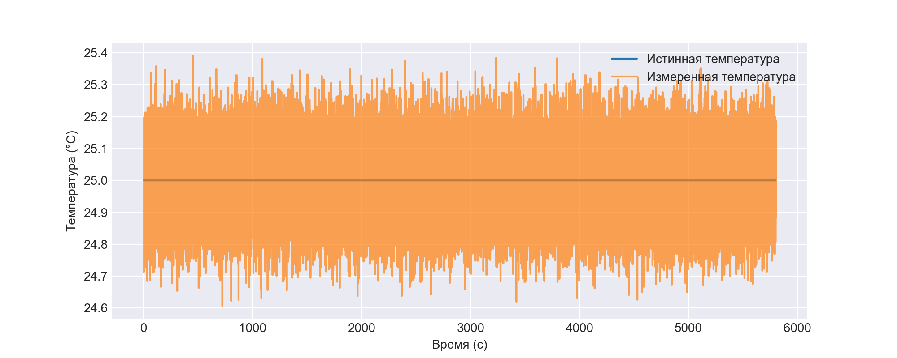

# Отчёт по симуляции: record
**Исходный файл:** `record.csv`

## Метрики оценки SoC
| Метрика | Значение (отн. ед.) | Значение (%) |
|---------|---------------------|--------------|
| RMSE | 0.000419 | 0.0419 % |
| MAE  | 0.000243 | 0.0243 % |
| Max Error | 0.037317 | 3.7317 % |

## Измерение напряжения
RMSE (истинное vs измеренное): 0.009962 В

## Информация об эксперименте
Всего кадров: 57998
Длительность: 5799.8 с

## Графики
### Напряжение

### Степень заряда (первые 0% данных)

### Ошибка SoC (первые 0% данных)

### Ток

### Температура
